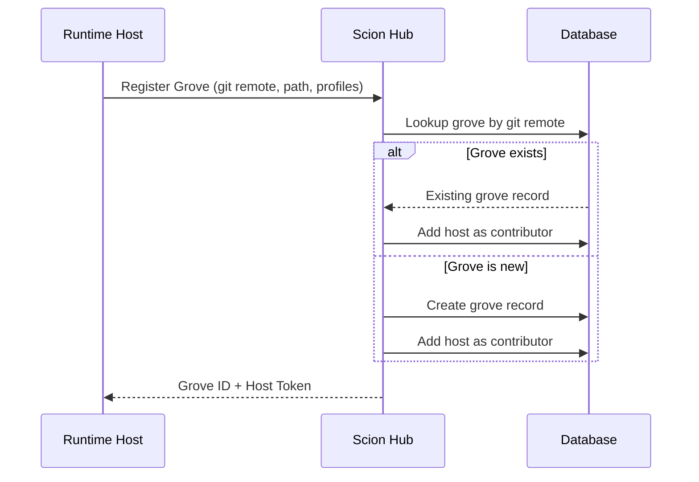
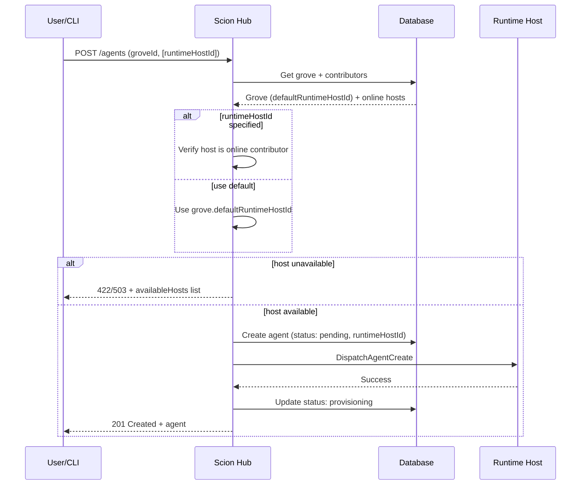

# Hosted Scion Architecture Design

## Status
**Proposed**

## 1. Overview
This document outlines the architecture for transforming Scion into a distributed platform supporting multiple runtime environments. The core goal is to separate the **State Management** (persistence/metadata) from the **Runtime Execution** (container orchestration).

The architecture introduces:
*   **Scion Hub (State Server):** A centralized API and database for agent state, groves, templates, and users.
*   **Groves (Projects):** The primary unit of registration with the Hub. A grove represents a project/repository and is the boundary through which runtime hosts interact with the Hub.
*   **Runtime Hosts:** Compute nodes with access to one or more container runtimes (local Docker, Kubernetes cluster, etc.). Hosts expose functionality *through* their registered groves, not as standalone entities.

This distributed model supports fully hosted SaaS scenarios, hybrid local/cloud setups, and "Solo Mode" (standalone CLI) using the same architectural primitives.

### Key Architectural Principle: Grove-Centric Registration

The **Grove** is the fundamental unit of Hub registration, not the Runtime Host. When a local development environment or server connects to a Hub, it registers one or more groves. This design reflects the reality that:

1. **Groves have identity** - A grove is uniquely identified by its git remote URL (when git-backed). This provides a natural deduplication mechanism.
2. **Hosts are ephemeral** - Developer laptops come and go; what matters is the project they're working on.
3. **Groves can span hosts** - Multiple developers (runtime hosts) can contribute agents to the same grove.
4. **Profiles are per-grove** - Runtime configuration (Docker vs K8s, resource limits) is defined in grove settings.

### Modes

#### Solo
The scion CLI operates in its traditional local way. State storage is in the form of files in the agent folders and labels on running containers. No Hub connectivity.

#### Read-Only (Reporting)
The grove is registered with a Hub for visibility, but the Hub cannot control agent lifecycle. The local CLI/Manager remains the source of truth and reports state changes to the Hub:
*   Local state files remain authoritative
*   The `sciontool` dual-writes status to both local state and Hub
*   Commands like `scion list` consult local state
*   A background daemon maintains the Hub connection and sends heartbeats
*   The Hub can observe agents but not create/start/stop/delete them

#### Connected (Full Control)
The grove is fully managed through the Hub. The Hub has complete control over agent lifecycle:
*   Hub is the source of truth for agent state
*   The Hub can create, start, stop, and delete agents on behalf of users
*   Multiple runtime hosts can contribute to the same grove
*   Web-based PTY and management are available

## 2. Goals & Scope
*   **Grove-Centric Registration:** Groves are the unit of registration with the Hub. Runtime hosts register the groves they serve.
*   **Git Remote as Identity:** Groves associated with git repositories are uniquely identified by their git remote URL. This ensures a single Hub grove maps to exactly one repository.
*   **Distributed Groves:** A single grove can span multiple runtime hosts (e.g., multiple developers working on the same project).
*   **Centralized State:** Agent metadata is persisted in a central database (Scion Hub), enabling cross-host visibility.
*   **Flexible Runtime:** Agents can run on local Docker, a remote server, or a Kubernetes cluster. Runtime configuration is defined per-grove in profiles.
*   **Unified Interface:** Users interact with the Scion Hub API (or a CLI connected to it) to manage agents across any host.
*   **Web-Based Access:** Support for web-based PTY and management for hosted agents.

## 3. High-Level Architecture

```mermaid
graph TD
    User[User (CLI)] -->|HTTPS/WS| Hub[Scion Hub (State Server)]
    Browser[User (Browser)] -->|HTTPS/WS| Web[Web Frontend]
    Web -->|Internal API| Hub

    Hub -->|DB| DB[(Firestore/Postgres)]

    subgraph Grove: my-project (git@github.com:org/repo.git)
        HostA[Runtime Host A (K8s)] -->|Agents| PodA[Agent Pod]
        HostB[Runtime Host B (Docker)] -->|Agents| ContainerB[Agent Container]
    end

    Hub <-->|Grove Registration| HostA
    Hub <-->|Grove Registration| HostB

    Web -.->|PTY Proxy| Hub
    User -.->|Direct PTY (Optional)| HostA
```

### Server Components

The distributed Scion platform consists of three server components, all implemented in the same binary:

| Component | Port | Purpose |
|-----------|------|---------|
| **Runtime Host API** | 9800 | Agent lifecycle on compute nodes |
| **Hub API** | 9810 | Centralized state, routing, coordination |
| **Web Frontend** | 9820 | Browser dashboard, OAuth, PTY relay |

See `server-implementation-design.md` for detailed server configuration.

### Registration Flow



## 4. Core Components

### 4.1. Scion Hub (State Server)
The central authority responsible for:
*   **Persistence:** Stores `Agents`, `Groves`, `Users`, and `Templates`.
*   **Grove Registry:** Maintains the canonical registry of groves, enforcing git remote uniqueness.
*   **Host Tracking:** Tracks which runtime hosts contribute to each grove.
*   **Routing:** Directs agent operations to the appropriate runtime host(s) within a grove.
*   **API:** Exposes the primary REST interface for clients.

### 4.2. Grove (Project) — The Registration Unit
The grove is the **primary unit of registration** with the Hub. A grove represents a project, typically backed by a git repository.

*   **Identity:** Groves with git repositories are uniquely identified by their normalized git remote URL. This is enforced at the Hub level.
*   **Distributed:** A grove can span multiple runtime hosts. Each host that registers the same grove (identified by git remote) becomes a contributor.
*   **Default Runtime Host:** Each grove has a default runtime host (`defaultRuntimeHostId`) that is used when creating agents without an explicit host. This is automatically set to the first runtime host that registers with the grove.
*   **Profiles:** Runtime configuration (Docker vs K8s, resource limits, etc.) is defined per-grove in the settings file. Hosts advertise which profiles they can execute.
*   **Hub Record:** The Hub maintains:
    *   Grove metadata (name, slug, git remote, owner)
    *   Default runtime host ID for agent creation
    *   List of contributing hosts
    *   Aggregate agent count and status

### 4.3. Runtime Host
A compute node with access to one or more container runtimes. Hosts do not register themselves as standalone entities; instead, they register the groves they serve.

*   **Grove Registration:** On startup (or on-demand), a host registers one or more local groves with the Hub.
*   **Runtime Providers:** Access to one or more runtimes:
    *   **Docker/Container:** Local container orchestration
    *   **Kubernetes:** Cluster-based pod orchestration
    *   **Apple:** macOS virtualization framework
*   **Profile Execution:** Hosts advertise which grove profiles they can execute based on available runtimes.
*   **Operational Modes:** (See Section 1)
    *   **Connected:** Hub has full agent lifecycle control
    *   **Read-Only:** Hub can observe but not control
*   **Agent Communication:** Configures the `sciontool` inside agents to report status back to the Hub.

### 4.4. Scion Tool (Agent-Side)
The agent-side helper script.
*   **Dual Reporting:** Reports status to the local runtime host *and* (if configured) the central Scion Hub.
*   **Identity:** Injected with `SCION_AGENT_ID`, `SCION_GROVE_ID`, and `SCION_HUB_ENDPOINT`.

### 4.5. Web Frontend
The browser-based dashboard for user interaction. Detailed specifications are in `server-implementation-design.md`.

*   **Static Assets:** Serves the compiled SPA (embedded in binary or from filesystem).
*   **Authentication:** Handles OAuth login flows (Google, GitHub, OIDC) and session management.
*   **Hub Proxy:** Optionally proxies API requests to the Hub API, simplifying CORS and auth.
*   **PTY Relay:** Proxies WebSocket PTY connections from browsers to the Hub/Runtime Hosts.
*   **Deployment:** Typically deployed alongside the Hub API; can be deployed separately if needed.

## 5. Detailed Workflows

### 5.1. Grove Registration
1.  **Runtime Host** starts up or user runs `scion hub link`.
2.  **Runtime Host** reads local grove configuration (path, git remote, profiles).
3.  **Runtime Host** calls Hub API: `POST /groves/register` with:
    *   Git remote URL (normalized)
    *   Grove name/slug
    *   Available profiles and runtimes
    *   Host identifier and capabilities
4.  **Scion Hub**:
    *   Looks up existing grove by git remote URL.
    *   If found: adds this host as a contributor to the existing grove.
    *   If not found: creates a new grove record with this host as the initial contributor.
    *   If the grove has no `defaultRuntimeHostId`, sets this host as the default.
    *   Returns grove ID and host authentication token.
5.  **Runtime Host** stores the grove ID and token for subsequent operations.

### 5.2. Agent Creation (Hosted/Distributed)
1.  **User** requests agent creation via Scion Hub API, specifying grove and optionally a `runtimeHostId`.
2.  **Scion Hub** resolves the runtime host:
    *   If `runtimeHostId` is explicitly provided, verify it's a valid, online contributor to the grove.
    *   Otherwise, use the grove's `defaultRuntimeHostId` (set when the first host registers).
    *   If the resolved host is unavailable or no host is configured, return an error with a list of available alternatives.
3.  **Scion Hub**:
    *   Creates `Agent` record with the resolved `runtimeHostId` (Status: `PENDING`).
    *   Sends `CreateAgent` command to the Runtime Host.
    *   Updates status to `PROVISIONING` on successful dispatch.
4.  **Runtime Host**:
    *   Allocates resources (PVC, Container) according to the selected profile.
    *   Starts the Agent.
    *   Injects Hub connection details.
5.  **Agent**:
    *   Starts up.
    *   `sciontool` reports `RUNNING` status to Scion Hub.



### 5.3. Web PTY Attachment
1.  **User** connects to Scion Hub WebSocket for a specific agent.
2.  **Scion Hub** identifies which Runtime Host is running the agent.
3.  **Scion Hub** proxies the connection to the Runtime Host via the control channel.
4.  **Runtime Host** streams the PTY from the container.

### 5.4. Standalone Mode (Solo)
*   The Scion CLI acts as both the **Hub** (using local file DB) and the **Runtime Host** (using Docker).
*   No Hub registration or external network dependencies required.
*   Can be upgraded to Read-Only mode by configuring a Hub endpoint.

## 6. Migration & Compatibility
*   **Manager Interface:** The `pkg/agent.Manager` will be split/refined to support remote execution.
*   **Storage Interface:** Introduce `pkg/store` interface to abstract `sqlite` (local) vs `firestore` (hosted).